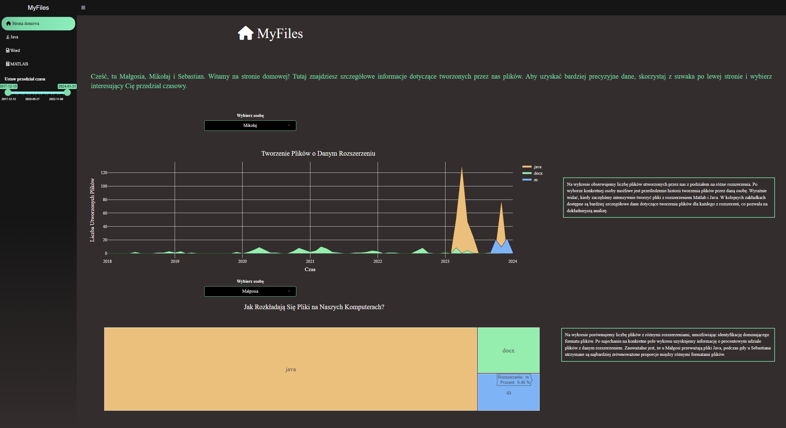
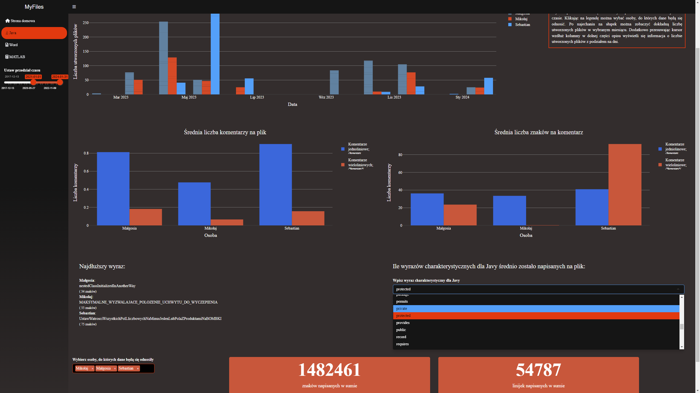
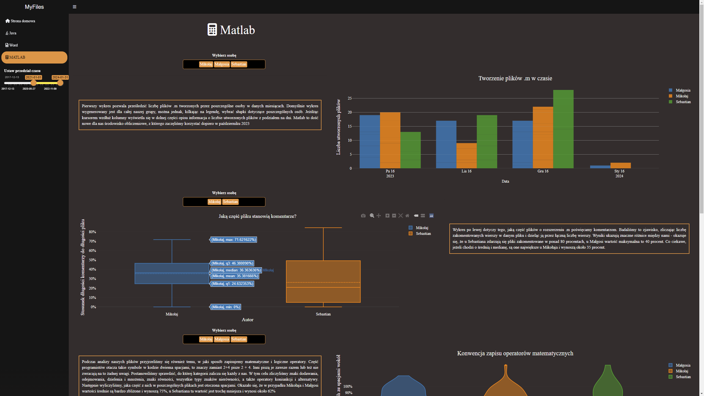
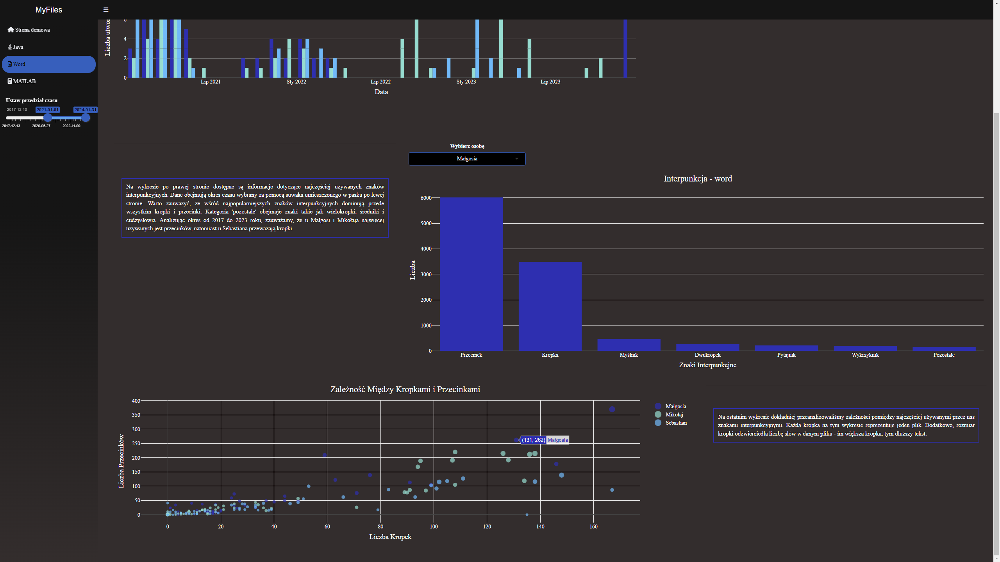

# MyFiles (Projekt JA)

Data visualisation dashboard for Data Visualization Techniques course in the second year of Data Science studies at the Warsaw University of Technology.

The project includes a detailed analysis of the .m, .docx and .java files created by the project authors. The graphs created show the distribution of the creation of these files over time, as well as the typical issues for each extension. The application was written in R using the packages shiny, dplyr and plotly (mainly).

Authors: 

[@MalgorzataMokwa](https://github.com/malgosiam2) - Word and home pages

[@SebstianPergala](https://github.com/Sebislaw) - Java page

[@MikolajRowicki](https://github.com/MikolajRowicki) - Matlab page

To see the app click the link below:
**[here](https://rowickim.shinyapps.io/MyFiles/)**.

Home page

  

Java page

  

Matlab page

  

Word page

  

## Selected statistics

### General
- breakdown of file creation over time
- quantitative distribution of files with particular extensions on our computers

### Java
- creation date
- average number of comments per file
- average number of characters per comment
- java-specific word count
- longest word
- counting characters and lines written in total

### Word
- date of file creation
- punctuation analysis: number of individual punctuation marks
- determining the average complexity of sentences as a function of the number of full stops and commas

### Matlab
- date of file creation
- proportion of comments in the file
- frequency of occurrence of individual mathematical and logical operators and their notation conventions
- the number of lines ending in a semicolon
- the number of lines which should end with a semicolon
- average number of characters in a non-empty line
